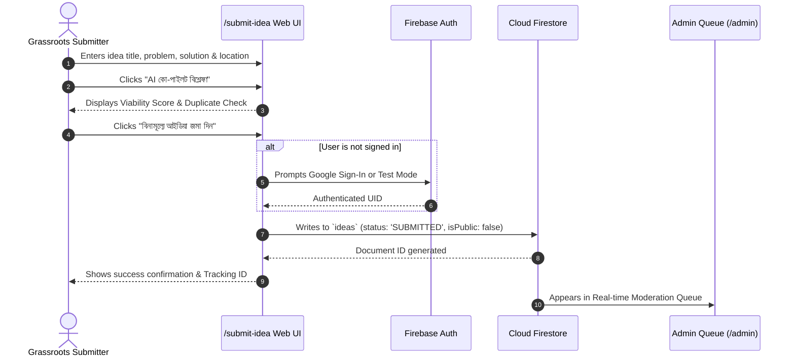
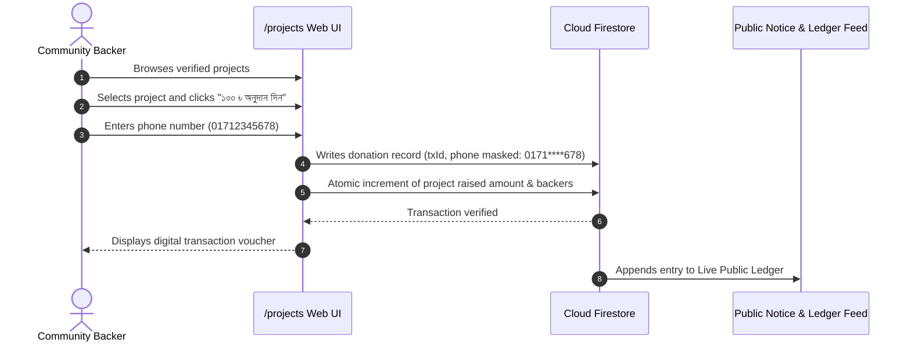

# End-to-End User Journeys
**Platform:** EKOTAI BOL (একতাই বল)  

---

## 1. Journey 1: Submitting an Idea

```mermaid
sequenceDiagram
    autonumber
    actor Submitter as Grassroots Submitter
    participant UI as /submit-idea Web UI
    participant Auth as Firebase Auth
    participant Firestore as Cloud Firestore
    participant Admin as Admin Queue (/admin)

    Submitter->>UI: Enters idea title, problem, solution & location
    Submitter->>UI: Clicks "AI কো-পাইলট বিশ্লেষণ"
    UI-->>Submitter: Displays Viability Score & Duplicate Check
    Submitter->>UI: Clicks "বিনামূল্যে আইডিয়া জমা দিন"
    alt User is not signed in
        UI->>Auth: Prompts Google Sign-In or Test Mode
        Auth-->>UI: Authenticated UID
    end
    UI->>Firestore: Writes to `ideas` (status: 'SUBMITTED', isPublic: false)
    Firestore-->>UI: Document ID generated
    UI-->>Submitter: Shows success confirmation & Tracking ID
    Firestore->>Admin: Appears in Real-time Moderation Queue
```

---

## 2. Journey 2: Micro-Donation & Public Ledger Update

```mermaid
sequenceDiagram
    autonumber
    actor Donor as Community Backer
    participant UI as /projects Web UI
    participant Firestore as Cloud Firestore
    participant Ledger as Public Notice & Ledger Feed

    Donor->>UI: Browses verified projects
    Donor->>UI: Selects project and clicks "১০০ ৳ অনুদান দিন"
    Donor->>UI: Enters phone number (01712345678)
    UI->>Firestore: Writes donation record (txId, phone masked: 0171****678)
    UI->>Firestore: Atomic increment of project raised amount & backers
    Firestore-->>UI: Transaction verified
    UI-->>Donor: Displays digital transaction voucher
    Firestore->>Ledger: Appends entry to Live Public Ledger
```
